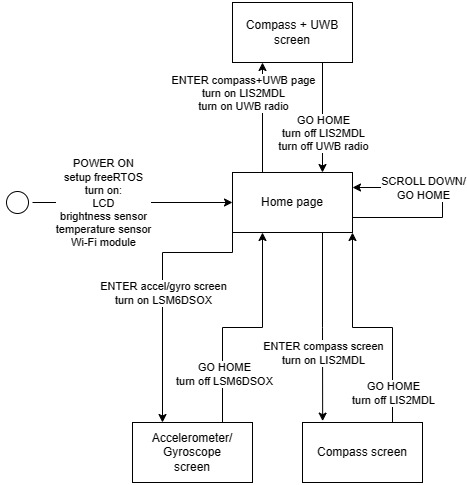
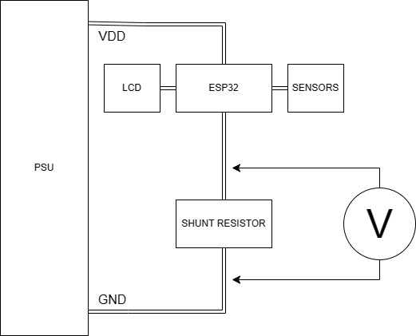

# IoT Relative Localization and Environmental Sensing System

This project involves the development of firmware for an **ESP32-based** IoT device. The system integrates **UWB** technology for relative node localization and a suite of environmental sensors, all managed through a custom GUI on an LCD display.

## Overview

The firmware is designed to be fast, robust, and energy-efficient. It localizes surrounding nodes without a fixed global reference and renders a local map in real-time. Key data is also transmitted to a remote server via Wi-Fi for further monitoring.

## Hardware Components

- **MCU**: ESP-32 (4MB RAM) 
- **Localization**: Ultra-Wide Band (UWB) radio 
- **Sensors**:
  - **Magnetometer (LIS2MDL)**: For digital compass implementation.
  - **Accel/Gyro (LSM6DSOX)**: For movement and tilt detection.
  - **Temp/Humidity (SHT4X)**: For environmental monitoring.
  - **Brightness (TSL2591)**: For dynamic LCD backlight adjustment.
- **Display**: 240x240 RGB LCD (SPI-based) 
- **Inputs**: 3 physical buttons for UI navigation

## Software Architecture

The system is built on the **ESP-IDF** framework and leverages **FreeRTOS** for concurrent task management.

- **Concurrency**: Separate FreeRTOS tasks for each sensor, the GUI, and Wi-Fi communication, using thread-safe queues for data exchange.
- **Graphics**: Custom driver-based library (**dispcolor**) for SPI display updates. Added via submodules, credits to: [Electronics in focus](https://www.youtube.com/channel/UChButpZaL5kUUl_zTyIDFkQ).
- **Connectivity**: Wi-Fi station mode sending JSON-formatted data via **UDP** to minimize overhead.
- **Power Optimization**: Implementation of low-power modes for sensors and task suspension based on the active UI screen.

## Power Analysis Highlights

A detailed power analysis was conducted using an oscilloscope and shunt resistor setup. The results can be found in the power_analysis/ folder

